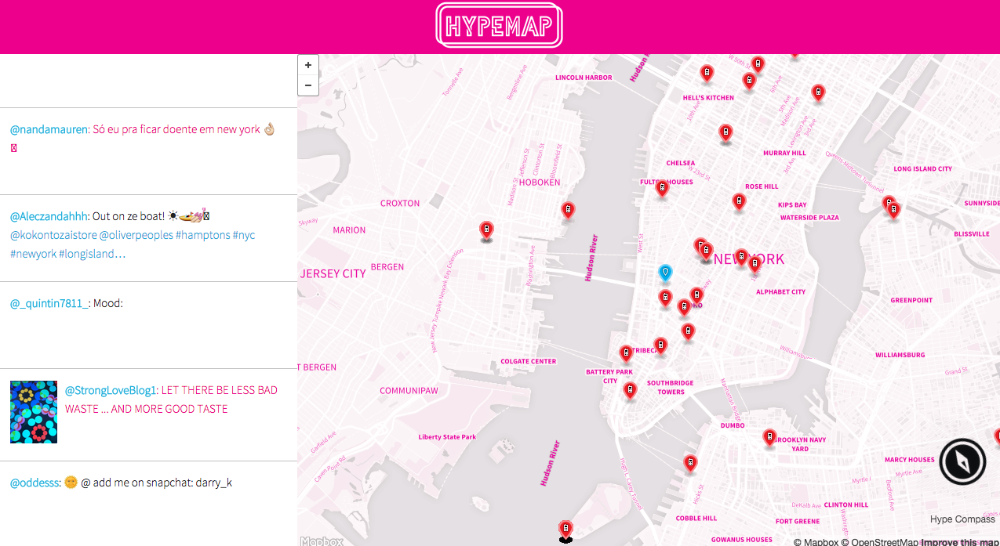

HYPEmap - AngelHack2015
============

### Find The Hype.

SET UP
============
1. Install Node.js
2. Fork/clone this repo
3. Install required packages => run `npm install` in root of repo
4. Fill out secrets.js.template accordingly and rename to secrets.js
5. Start the server => run `node server.js`
6. Go to "http://localhost:3000/" to see app in action
7. Follow the HYPE and have a good time

